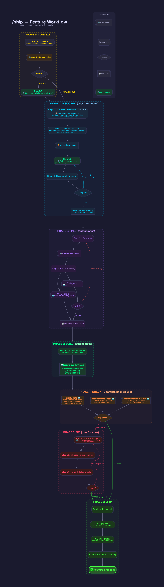

# /ship — Autonomous Feature Workflow for Claude Code



**From idea to pull request — fully autonomous after discovery.**

`/ship` is a Claude Code slash command that orchestrates an entire feature development lifecycle: understanding requirements, writing specifications, implementing code, running quality checks, and creating a pull request. You only interact during the initial discovery phase to answer clarifying questions — everything else runs autonomously.

## How It Works

```
/ship add rent payment reminders
```

The workflow runs through 7 phases:

| Phase | Name | Mode | What Happens |
|-------|------|------|--------------|
| 0 | **Context** | Auto | Initializes spec folder, detects resume points, creates git branch |
| 1 | **Discover** | Interactive | Swarm agents research the codebase; spec-shaper asks you clarifying questions (max 3 rounds) |
| 2 | **Spec** | Auto | Writes formal specification + ordered task breakdown, verifies spec integrity |
| 3 | **Build** | Auto | Single feature-builder agent implements the entire feature following the spec |
| 4 | **Check** | Auto | Parallel quality gate (tests, linting, Brakeman), code reviews (security, performance, quality, multi-tenancy), requirements coverage, and visual verification via Playwright |
| 5 | **Fix** | Auto | Auto-fixes issues found in checks (up to 3 cycles) |
| 6 | **Ship** | Auto | Commits, pushes, creates PR with verification summary |

## Architecture

The system follows a strict **orchestrator + subagent** pattern:

- **Main window is orchestrator only** — never reads code, never runs tests, never sees verbose output
- **All heavy work runs in specialized subagents** that communicate via 1-line responses
- **File-based IPC** — subagents write findings to the spec folder, not through the Task API
- **Swarm for research, single agent for implementation** — parallel Explore agents gather context fast; one feature-builder implements everything for consistency
- **Parallel by default** — independent work launches concurrently

### Subagents

| Agent | Role | Model |
|-------|------|-------|
| `spec-initializer` | Creates spec folders, detects resume points, handles git branching | haiku |
| `spec-shaper` | Analyzes features, researches codebase, generates structured discovery questions | opus |
| `spec-writer` | Writes formal specification documents from requirements | opus |
| `spec-verifier` | Verifies spec accuracy, structural integrity, and reusability | opus |
| `task-list-creator` | Breaks spec into ordered implementation tasks | opus |
| `feature-builder` | Implements the entire feature from spec + tasks | opus |
| `quality-gate` | Runs tests, linting, Brakeman, DB consistency + 5 code review scripts | sonnet |
| `implementation-verifier` | Browser-based verification via Playwright + runtime monitoring | sonnet |

### Quality Reviews (via `bin/` scripts)

Each review runs in its own Claude Code context:

- `bin/review-security` — Security audit
- `bin/review-performance` — Performance analysis
- `bin/review-quality` — Code quality review
- `bin/review-multitenancy` — Multi-tenancy isolation check
- `bin/codex-review` — General code review

## Setup

1. Copy the `.claude/` directory and `bin/` directory into your project root
2. Make the review scripts executable:
   ```bash
   chmod +x bin/review-* bin/codex-review
   ```
3. Run `/ship` followed by a feature description in Claude Code

## Spec Folder Structure

Each feature gets a dated spec folder under `specs/`:

```
specs/2026-02-07-rent-reminders/
├── planning/
│   ├── visuals/              # Mockups/screenshots (optional)
│   ├── requirements.md       # Gathered from discovery Q&A
│   ├── architecture-critique.md  # Self-critique of proposed architecture
│   ├── research-data.md      # Codebase research: models, migrations
│   ├── research-logic.md     # Codebase research: services, jobs
│   └── research-presentation.md  # Codebase research: controllers, views
├── implementation/           # Implementation reports
├── verifications/            # Quality gate results, review reports
├── spec.md                   # Formal specification
├── tasks.json                # Ordered implementation tasks
└── session.txt               # Session ID for resume detection
```

## Resume Support

Running `/ship` without arguments detects existing specs and offers to resume from where it left off. Resume detection is based on which files exist in the spec folder — no manual tracking needed.

## Error Handling

| Error | Action |
|-------|--------|
| Subagent timeout | Retry once, then skip and note in PR |
| Git conflict | Report to user — does not force resolve |
| Network error on push | Retry 4x with exponential backoff |
| All 3 fix cycles exhausted | Creates PR with warning and lists remaining issues |
| Spec verification fails 2x | Proceeds with best-effort spec, noted in PR |

## Requirements

- [Claude Code](https://docs.anthropic.com/en/docs/claude-code) CLI
- A Rails project (the agents are tailored for Rails conventions)
- `gh` CLI for PR creation
- Playwright MCP server (for visual verification)
